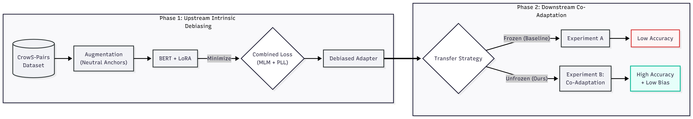
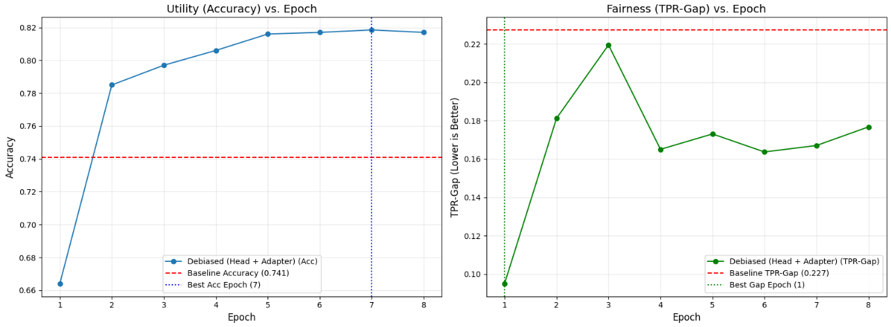

# Post-Hoc Debiasing of BERT via Combined-Loss LoRA and Downstream Co-Adaptation

> **⚠️ Project Status:** This repository is currently **public for academic evaluation purposes.**



## 📌 Abstract
This project introduces a novel two-stage framework to mitigate societal stereotypes in Large Language Models (BERT) without sacrificing downstream performance. We propose a **Combined Loss** function for intrinsic debiasing and a **Co-Adaptation** strategy for downstream transfer, effectively solving the "Fairness-Utility Trade-off" often seen in existing literature.

## 🚀 Key Features
* **Combined Loss Objective:** Optimizes $L_{MLM} + L_{PLL}$ to balance linguistic utility and fairness intrinsically.
* **LoRA Integration:** Uses Low-Rank Adaptation for parameter-efficient training (training <1% of parameters).
* **Co-Adaptation:** Challenges standard freezing techniques by demonstrating that **unfreezing** adapters recovers **12% more accuracy** than frozen baselines while maintaining fairness.

## 📂 Repository Structure
We have organized the codebase to separate our main contribution from supplementary scientific validation:

| Folder/File | Description |
| :--- | :--- |
| **`notebooks/main_project.ipynb`** | **Start Here.** The core implementation containing the Combined Loss Trainer, Co-Adaptation logic, and the final "Hero" results (81.9% Acc). |
| **`ablations/`** | Contains supplementary experiments and negative results (e.g., "Triplet Loss Failure", "No Utility Loss") that scientifically justify our final architectural choices. |
| **`checkpoints/`** | Stores trained LoRA weights for both the Upstream (Intrinsically Debiased) and Downstream (Co-Adapted) models. |

## 🛠️ Methodology
1. **Upstream Phase:** Intrinsic debiasing using the **CrowS-Pairs** dataset with a custom `neutralize` augmentation strategy.
2. **Downstream Phase:** Transfer learning on the **Bias in Bios** dataset comparing Frozen (Baseline) vs. Unfrozen (Co-Adaptation) strategies.

## 📊 Results
| Method | Accuracy | TPR-Gap (Fairness) |
| :--- | :--- | :--- |
| Baseline (Frozen Adapter) | 69.6% | 0.227 |
| **Co-Adaptation (Ours)** | **81.9%** | **0.167** |

> *Our method achieves a "Win-Win," outperforming the baseline in both accuracy and fairness.*



## 💻 Installation & Usage
1. Clone the repo:
   ```bash
   git clone [https://github.com/yourusername/Post-Hoc-Debiasing-BERT.git](https://github.com/yourusername/Post-Hoc-Debiasing-BERT.git)